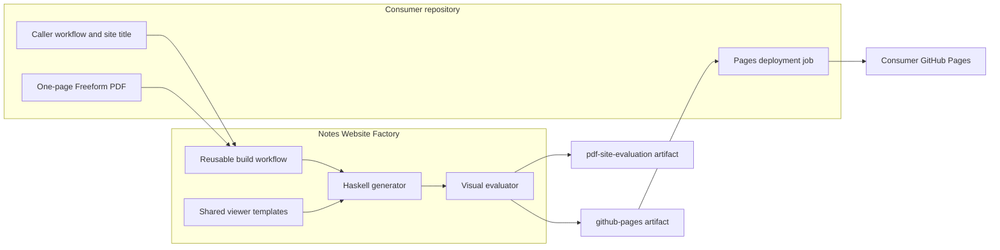
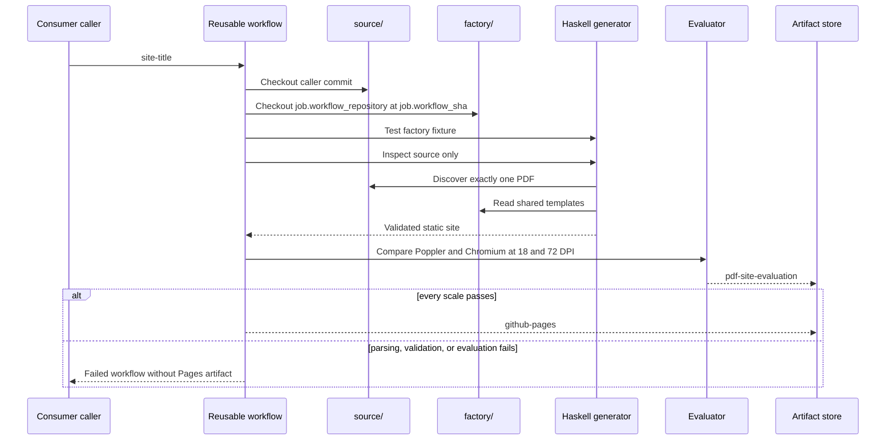
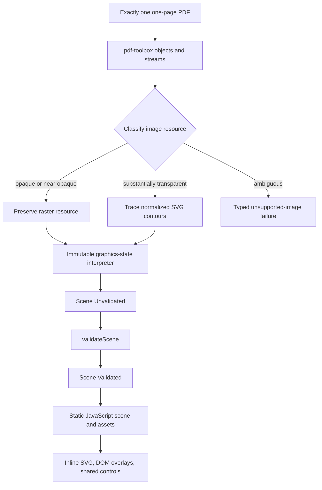

# Architecture

## System Context

The consumer controls content identity and deployment authority. The factory controls every transformation from PDF objects to a validated browser product. The reusable workflow has only `contents: read`; it cannot deploy or request an OpenID Connect token.

## Checkout and Build Sequence

Separate checkout and output roots prevent a factory fixture from contaminating consumer discovery. `job.workflow_sha` prevents a workflow loaded from one commit from independently checking out different generator code, including when callers use `@main`.

## Production Data Flow

The production path never renders a full-page PDF image. Poppler exists only in the independent evaluation path.

## Module Boundaries

| Module | Responsibility | Effects |
| --- | --- | --- |
| `Factory.Domain` | Coordinates, matrices, nodes, assets, titles, validation phases, and errors | None |
| `Factory.Geometry` | PDF-to-board transformations and affine matrix operations | None |
| `Factory.Interpreter` | PDF operator state machine and scene-node emission | None |
| `Factory.Vectorize` | Image classification, quantization, contour tracing, and simplification | None |
| `Factory.Pdf` | PDF objects, streams, resources, annotations, and raster materialization | File input and asset output |
| `Factory.Site` | Scene validation, metadata rendering, and deterministic site emission | Template and site output |
| `Factory.Evaluation` | Poppler/Chromium execution, metrics, images, and reports | Processes and report output |
| `Factory.Pipeline` | CLI dispatch, discovery, protected paths, staging, and promotion | Filesystem orchestration |
| `site/runtime.js` | Shared rendering and desktop/mobile interaction behavior | Browser DOM |
| `build-pdf-site.yml` | Isolated checkouts, toolchain, evaluation, and artifact upload | GitHub Actions |

## Safety Boundaries

1. `discoverSinglePdf` scans only the consumer source root and requires one non-symlink PDF.
2. The parser requires exactly one page and fails on unsupported structures.
3. `classifyImage` preserves masks at or below `0.005` transparent samples, traces masks at or above `0.01`, and rejects the interval.
4. `validateScene` checks dimensions, references, finite values, opacities, image transforms, and the full-board-raster prohibition.
5. Output, staging, backup, scratch, and report paths must not equal or contain source or template roots.
6. Output is written to `DIST.building` before atomic-style promotion through `DIST.previous`.
7. Distribution checks require product files, relative references, no PDF, and no Canvas fallback without assuming scene counts.
8. The Pages artifact is uploaded only after parsing, validation, browser readiness, and both visual scales pass.

## Determinism and Compatibility

- PDF resources, classification, contours, and generated JSON remain deterministically ordered.
- The dependency solver, GHC, Cabal, and third-party actions are pinned.
- Poppler and Chrome revisions can change antialiasing, so fixed tolerances replace exact pixel equality.
- `site-title`, `github-pages`, `pdf-site-evaluation`, and generated filenames are public contracts.
- A moving `main` reference intentionally updates consumers on their next run; factory CI exercises the actual reusable workflow before merge.

[ADR 0001](/adr/0001-vector-first-mixed-rendering.md) owns mixed rendering. [ADR 0002](/adr/0002-separate-factory-and-consumers.md) owns repository boundaries. [ADR 0003](/adr/0003-build-artifacts-with-a-reusable-workflow.md) owns workflow and deployment responsibilities. [BDR 0002](/bdr/0002-reusable-workflow-build-contract.md) owns observable artifact behavior.
