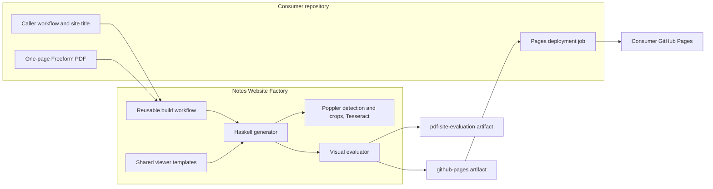
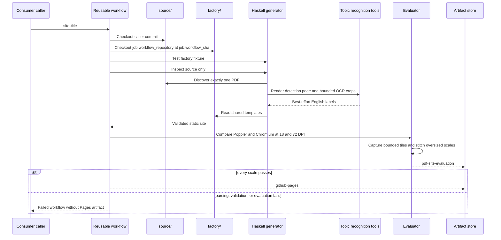
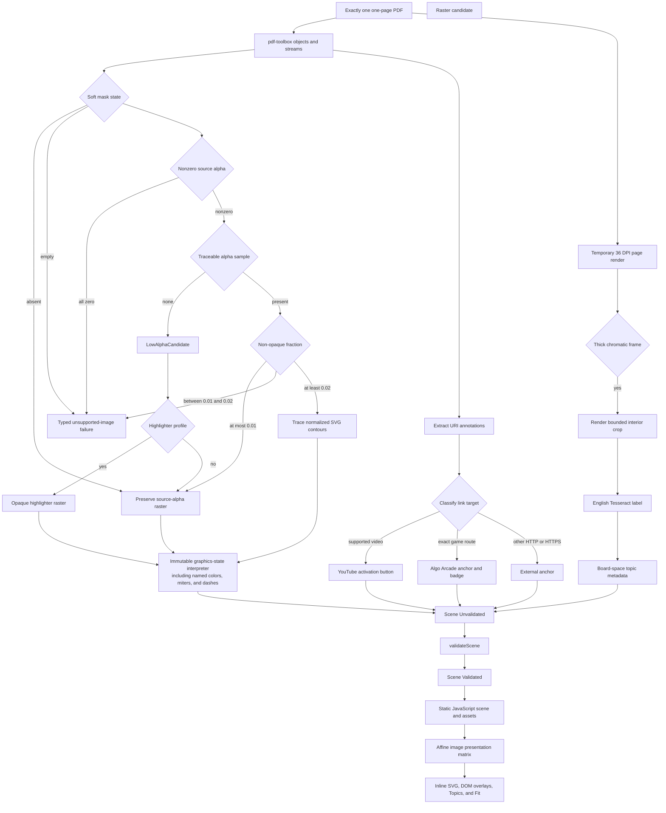

# Architecture

## System Context

The consumer controls content identity and deployment authority. The factory controls every transformation from PDF objects to a validated browser product. The reusable workflow has only `contents: read`; it cannot deploy or request an OpenID Connect token.

## Checkout and Build Sequence

Separate checkout and output roots prevent a factory fixture from contaminating consumer discovery. `job.workflow_sha` prevents a workflow loaded from one commit from independently checking out different generator code, including when callers use `@main`.

## Production Data Flow

The deployed product never contains a full-page PDF image. During the build, topic recognition detects relative frame geometry from a removable low-resolution composited render, asks Poppler for only each accepted high-resolution interior, and removes all temporary images before promotion. Low-alpha content remains lossless RGBA unless the pure geometry-and-chroma profile positively identifies an elongated highlighter stroke, whose nonzero pixels become opaque. The shared viewer composes each PDF image matrix with the image-sample vertical orientation, preserving rotation and shear for raster and traced artwork. Tesseract labels remain normal-mode interaction metadata and never replace source pixels. Oversized evaluation scales use bounded Chromium viewports that `Factory.Evaluation` stitches before applying the same complete-image comparison. Data-flow drift is caught by focused tests, real-consumer evaluation, and review of this diagram.

## Module Boundaries

| Module | Responsibility | Effects |
| --- | --- | --- |
| `Factory.Domain` | Coordinates, matrices, color spaces, paint styles, nodes, typed link targets, assets, titles, validation phases, and errors | None |
| `Factory.Geometry` | PDF-to-board transformations and affine matrix operations | None |
| `Factory.Interpreter` | PDF operator state machine and scene-node emission | None |
| `Factory.Vectorize` | Image classification, highlighter opacity profiling, quantization, contour tracing, and simplification | None |
| `Factory.Topic` | Composited highlighter-frame detection, visual-row ordering, and label normalization | None |
| `Factory.Ocr` | Poppler detection render, bounded crops, board placement, and local Tesseract execution | Processes and temporary image output |
| `Factory.Pdf` | PDF objects, streams, resources, annotations, structural URL classification, and raster materialization | File input and asset output |
| `Factory.Site` | Scene validation, metadata rendering, and deterministic site emission | Template and site output |
| `Factory.Evaluation` | Poppler/Chromium execution, bounded capture planning, image stitching, metrics, and reports | Processes and report output |
| `Factory.Pipeline` | CLI dispatch, discovery, protected paths, staging, and promotion | Filesystem orchestration |
| `site/runtime.js` | Shared affine rendering, evaluation-tile offsets, typed link activation, game affordances, and desktop/mobile interaction behavior | Browser DOM |
| `build-pdf-site.yml` | Isolated checkouts, toolchain, evaluation, and artifact upload | GitHub Actions |

## Safety Boundaries

1. `discoverSinglePdf` scans only the consumer source root and requires one non-symlink PDF.
2. The parser requires exactly one page and fails on unsupported structures.
3. `classifyImage` rejects empty and all-zero masks, preserves nonzero masks with no traceable sample, then applies the `0.01` raster boundary, the ambiguity interval, and the `0.02` vector boundary to traceable masks.
4. `validateScene` checks dimensions, references, finite values, paint values including miter limits and dash patterns, opacities, and the full-board-raster prohibition by testing every board corner against the transformed image bounds.
5. Existing removable locations are canonicalized, while symlink targets and unresolved symlink parents are rejected; removable paths cannot overlap source, templates, or another independently owned output root.
6. Output is written to `DIST.building` before atomic-style promotion through `DIST.previous`.
7. Distribution checks require product files, relative references, no PDF, and no Canvas fallback without assuming scene counts.
8. The Pages artifact is uploaded only after parsing, validation, browser readiness, and both visual scales pass.
9. A game target requires HTTPS, the exact case-insensitive host `bajor.github.io`, no credentials or explicit port, path `/algo-arcade/`, and a non-empty `#/games/` fragment route. Matching never uses substring checks.
10. The game badge appears only in normal interactive mode; evaluation mode retains the native link hit area but draws only PDF-derived pixels.
11. Topic detection uses relative chroma and border geometry on a fixed-resolution composited render; it cannot depend on a consumer hue, resource name, board dimension, or expected count.
12. Topic detection and crop paths remain inside removable staging space, are removed before promotion, and cannot enter the Pages artifact.
13. Poppler or Tesseract process failure aborts the build; successful empty OCR receives a deterministic non-source fallback label.
14. A low-alpha raster becomes opaque only when at least 95 percent of visible pixels are chromatic and its aspect ratio is at least `4:1`; the policy cannot depend on consumer identity or resource name.
15. Evaluation viewports are at most `8192x4096` pixels; larger reference dimensions are captured with deterministic offsets and stitched before full-image comparison.

## Determinism and Compatibility

- PDF resources, classification, contours, and generated JSON remain deterministically ordered.
- The dependency solver, GHC, Cabal, and third-party actions are pinned.
- Poppler and Chrome revisions can change antialiasing, so fixed tolerances replace exact pixel equality.
- Browser evaluation tiles depend only on output dimensions and fixed `8192`-pixel horizontal and `4096`-pixel vertical boundaries; tile files are removed after stitching.
- Topic order depends only on board coordinates; OCR output cannot reorder navigation targets.
- `site-title`, `github-pages`, `pdf-site-evaluation`, and generated filenames are public contracts.
- A moving `main` reference intentionally updates consumers on their next run; factory CI exercises the actual reusable workflow before merge.

[ADR 0001](/adr/0001-vector-first-mixed-rendering.md) owns mixed rendering. [ADR 0002](/adr/0002-separate-factory-and-consumers.md) owns repository boundaries. [ADR 0003](/adr/0003-build-artifacts-with-a-reusable-workflow.md) owns workflow and deployment responsibilities. [ADR 0004](/adr/0004-linked-game-cards.md) owns measured mask and game-link trust boundaries. [ADR 0006](/adr/0006-tile-oversized-browser-evaluations.md) owns bounded evaluation capture. [ADR 0008](/adr/0008-composited-topic-detection.md) owns topic recognition, and [ADR 0009](/adr/0009-opaque-highlighter-strokes.md) owns the low-alpha highlighter exception. [BDR 0002](/bdr/0002-reusable-workflow-build-contract.md), [BDR 0006](/bdr/0006-expanded-freeform-graphics-output.md), [BDR 0007](/bdr/0007-tiled-visual-evaluation.md), [BDR 0008](/bdr/0008-fixed-light-viewer.md), [BDR 0011](/bdr/0011-opaque-highlighter-output.md), and [BDR 0012](/bdr/0012-searchable-topic-menu.md) own current observable behavior.
