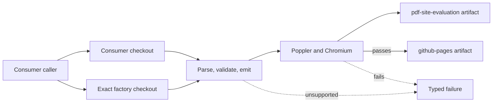

# Reusable Workflow Build Contract

## Behavior Flow

## Description

The caller supplies a title and repository checkout. PDF discovery reads only the consumer root. Templates and executable source read only the exact factory-workflow commit. Evaluation evidence is retained independently. The deployable artifact exists only after every required gate passes.

## Scenarios

1. Given a consumer with one supported one-page PDF and a valid title, when it calls the workflow, then `github-pages` and `pdf-site-evaluation` are uploaded.
2. Given zero, multiple, symlinked, or multi-page PDFs, when discovery or parsing runs, then the workflow fails and uploads no `github-pages` artifact.
3. Given supported content with source-specific dimensions or scene counts, when validation runs, then no Algorithms-specific count gate rejects it.
4. Given unsupported PDF content or an ambiguous soft mask, when parsing runs, then a typed failure is reported instead of silently omitting content.
5. Given an evaluation outside any fixed threshold, when comparison completes, then evidence is uploaded and the Pages artifact is withheld.
6. Given a consumer deployment job, when the reusable build succeeds on `main`, then the consumer may deploy without giving Pages permissions to the factory build job.
7. Given a workflow loaded from a moving reference, when the build starts, then factory source is checked out from `job.workflow_sha`, not independently from the moving reference.
8. Given a removable path that overlaps source, templates, or another output root, or uses a symlink target or unresolved symlink parent, when path validation runs, then the command fails before mutation.

## Test Design

| Scenario | Instrument | Proof |
| --- | --- | --- |
| 1 | Factory CI reusable-workflow call and real consumer run | Standard artifacts are produced. |
| 2 | Discovery integration checks and page-count parser behavior | Invalid source cardinality blocks output. |
| 3 | Synthetic vector-only fixture and real mixed consumer | Output validation is source-independent. |
| 4 | Focused interpreter and classification unit tests | Unsupported content fails explicitly. |
| 5 | `make evaluate` plus `report.html` inspection | Threshold failure cannot deploy. |
| 6 | Consumer caller workflow permissions and deployment job | Deployment authority remains consumer-owned. |
| 7 | Workflow checkout configuration and GitHub Actions smoke run | Workflow and implementation commits match. |
| 8 | Focused path-relation unit tests and symlink/overlap CLI checks | Input, site, and evidence ownership cannot be erased or mixed. |

# References

1. [Source-independent mixed scene BDR 0003](/bdr/0003-source-independent-mixed-scene-output.md)
2. [ADR 0003](/adr/0003-build-artifacts-with-a-reusable-workflow.md)
3. [Issue 0002](/issues/0002-extract-reusable-workflow-factory.md)
