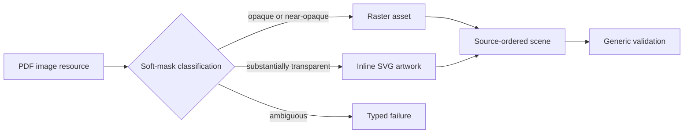

# Source-Independent Mixed Scene Output

## Behavior Flow

## Description

Image classification depends on decoded PDF resource properties, never a consumer filename or expected count. Raster and vector branches rejoin in PDF operator order. Generic scene validation accepts valid vector-only and mixed scenes, while independent Poppler/Chromium evaluation detects missing or misplaced visible content.

## Scenarios

1. Given an image with no soft mask, when resources are prepared, then the image is preserved as raster.
2. Given a substantially transparent soft mask, when resources are prepared, then the image becomes vector artwork.
3. Given a soft mask in the ambiguity interval, when resources are prepared, then the build fails with `UnsupportedImage`.
4. Given mixed raster and vector `Do` operators, when the interpreter emits nodes, then their source order is unchanged.
5. Given a vector-only source, when the site is built, then the scene is valid without raster assets.
6. Given any supported generated site, when Chromium renders at 18 and 72 DPI oracle scales, then each scale passes every configured visual threshold.

## Test Design

| Scenario | Instrument | Proof |
| --- | --- | --- |
| 1 | Unit test for `classifyImage Nothing` | Opaque resources stay raster. |
| 2 | Unit test with a transparent soft mask | Eligible artwork selects vector tracing. |
| 3 | Unit test with `0.006` transparent fraction | Ambiguity fails rather than guessing. |
| 4 | Interpreter unit test with raster then vector resources | Mixed nodes preserve order. |
| 5 | Scene-validation unit test and `make validate-dist` | Vector-only output is valid and requires no raster-assets directory. |
| 6 | `make evaluate` and report inspection | Poppler and Chromium agree within thresholds at both resolutions. |

# References

1. [Superseded BDR 0001](/bdr/0001-mixed-scene-output.md)
2. [ADR 0001](/adr/0001-vector-first-mixed-rendering.md)
3. [PRD 0002](/prd/0002-reusable-freeform-site-factory.md)
4. [Implementation issue 0002](/issues/0002-extract-reusable-workflow-factory.md)
