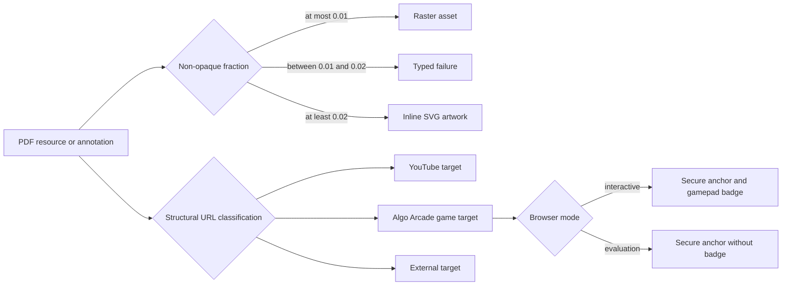

# Interactive Linked-Card Output

## Behavior Flow

## Description

Image classification remains source-independent and preserves an explicit ambiguity interval. URI annotations become typed targets through structural parsing. Exact Algo Arcade game routes receive a game-specific affordance in normal use, while evaluation mode compares only PDF-derived pixels.

## Scenarios

1. Given an image without a soft mask, when the image is classified, then it remains raster.
2. Given a soft mask with a non-opaque fraction at most `0.01`, when the image is classified, then it remains raster.
3. Given a soft mask above `0.01` and below `0.02`, when the image is classified, then the build fails with `UnsupportedImage`.
4. Given a soft mask with a non-opaque fraction at least `0.02`, when the image is classified, then it becomes vector artwork.
5. Given mixed raster and vector `Do` operators, when the interpreter emits nodes, then their source order is unchanged.
6. Given a vector-only source, when the site is built, then the scene is valid without raster assets.
7. Given an exact supported Algo Arcade game URI, when annotations are parsed, then the scene contains `Game GameUrl` and serialized target kind `game`.
8. Given an unrelated page or deceptive lookalike host, when annotations are parsed, then the scene retains an `External WebUrl` target.
9. Given a game target in normal mode, when the scene is built, then a native anchor exposes a route-specific game label, secure new-tab attributes, and an inline gamepad badge.
10. Given the same target in evaluation mode, when Chromium captures the board, then the badge is absent and the link hit area remains.
11. Given a supported refreshed consumer, when the factory evaluates it at 18 and 72 DPI, then both scales pass all fixed visual thresholds.

## Test Design

| Scenario | Instrument | Proof |
| --- | --- | --- |
| 1 | Unit test for `classifyImage Nothing` | Opaque resources stay raster. |
| 2 | Unit tests at `0.008` and exactly `0.01` | Observed linked-card masks and the inclusive boundary remain raster. |
| 3 | Unit test with `0.015` non-opaque fraction | The ambiguity interval still fails explicitly. |
| 4 | Unit test at exactly `0.02` | The inclusive vector boundary remains explicit. |
| 5 | Interpreter unit test with raster then vector resources | Mixed nodes preserve order. |
| 6 | Scene-validation unit test and `make validate-dist` | Vector-only output is valid and requires no raster-assets directory. |
| 7 | URL and JSON unit tests plus real-consumer scene inspection | The route receives the game target and JSON kind. |
| 8 | Unit tests for scheme, authority, path, root, and host lookalikes | Matching is structural and narrow. |
| 9 | `make test-runtime` normal-mode Chromium assertions | The route-specific label, secure anchor, YouTube button, and badge are present. |
| 10 | `make test-runtime` evaluation-mode Chromium assertions | The game anchor remains and the badge is absent. |
| 11 | Real-consumer `make evaluate` and `report.html` inspection | Both oracle scales pass without threshold changes. |

# References

1. [Superseded BDR 0003](/bdr/0003-source-independent-mixed-scene-output.md)
2. [Linked game card decision](/adr/0004-linked-game-cards.md)
3. [Interactive game-link requirements](/prd/0003-interactive-game-links.md)
4. [Implementation issue 0003](/issues/0003-support-interactive-game-links.md)
