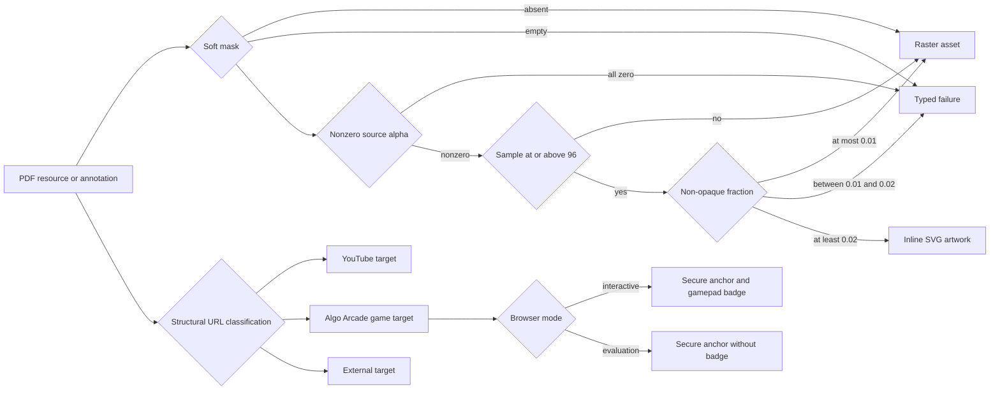

# Fidelity-Preserving Mixed Scene Output

## Context

A supported consumer can contain nonzero soft-mask content below the vector tracer's alpha cutoff. This record supersedes [BDR 0004](/bdr/0004-interactive-linked-card-output.md) by placing source-alpha and traceability checks before the existing fraction classifier while carrying forward mixed rendering and typed-link behavior.

## Behavior Flow

## Description

The factory preserves source content through one of two representations. Content that the tracer can represent follows the established fraction boundaries and normally becomes SVG artwork; opaque, near-opaque, and entirely low-alpha content remains raster. Empty, fully transparent, ambiguous, or otherwise unsupported content fails explicitly. URI annotations retain structural target classification, and evaluation mode compares only PDF-derived pixels.

## Scenarios

1. Given an image without a soft mask, when the image is classified, then it remains raster.
2. Given an empty soft mask, when the image is classified, then the build fails with `UnsupportedImage`.
3. Given a non-empty soft mask whose samples are all zero, when the image is classified, then the build fails with `UnsupportedImage`.
4. Given a soft mask with nonzero samples all below alpha `96`, when the image is classified, then it remains raster with its source alpha.
5. Given a soft mask containing alpha `96`, when the image is classified, then that sample is eligible for vector tracing.
6. Given a traceable soft mask with a non-opaque fraction at most `0.01`, when the image is classified, then it remains raster.
7. Given a traceable soft mask above `0.01` and below `0.02`, when the image is classified, then the build fails with `UnsupportedImage`.
8. Given a traceable soft mask with a non-opaque fraction at least `0.02`, when the image is classified, then it becomes vector artwork.
9. Given mixed raster and vector `Do` operators, when the interpreter emits nodes, then their source order is unchanged.
10. Given a vector-only source, when the site is built, then the scene is valid without raster assets.
11. Given an exact supported Algo Arcade game URI, when annotations are parsed, then the scene contains `Game GameUrl` and serialized target kind `game`.
12. Given an unrelated page or deceptive lookalike host, when annotations are parsed, then the scene retains an `External WebUrl` target.
13. Given a game target in normal mode, when the scene is built, then a native anchor exposes a route-specific game label, secure new-tab attributes, and an inline gamepad badge.
14. Given the same target in evaluation mode, when Chromium captures the board, then the badge is absent and the link hit area remains.
15. Given a supported consumer with low-alpha content, when the factory evaluates it at 18 and 72 DPI, then both scales pass all fixed visual thresholds.

## Test Design

| Scenario | Instrument | Proof |
| --- | --- | --- |
| 1 | Unit test for `classifyImage Nothing` | Images without masks stay raster. |
| 2 | Unit test with an empty byte string | Malformed empty masks fail explicitly. |
| 3 | Unit test with only zero samples | Fully transparent resources do not disappear silently. |
| 4 | Unit test with samples from `1` through `95`, plus real-consumer asset inspection | Low-alpha source content follows the lossless raster path. |
| 5 | Unit test with alpha exactly `96` | The tracing cutoff remains inclusive. |
| 6 | Unit tests at observed near-opaque values and exactly `0.01` | Near-opaque content remains raster. |
| 7 | Unit test with `0.015` non-opaque fraction | The ambiguity interval still fails explicitly. |
| 8 | Unit test at exactly `0.02` | The vector boundary remains inclusive. |
| 9 | Interpreter unit test with raster then vector resources | Mixed nodes preserve order. |
| 10 | Scene-validation unit test and `make validate-dist` | Vector-only output remains valid. |
| 11 | URL and JSON unit tests | Exact game routes receive the distinct typed target. |
| 12 | URL tests for scheme, authority, path, root, and lookalike hosts | Target matching remains structural and narrow. |
| 13 | `make test-runtime` normal-mode Chromium assertions | The accessible secure game affordance remains present. |
| 14 | `make test-runtime` evaluation-mode Chromium assertions | Synthesized badge pixels remain outside evaluation. |
| 15 | Real-consumer `make evaluate` and report inspection | Both oracle scales pass without threshold changes. |

# References

1. [Superseded BDR 0004](/bdr/0004-interactive-linked-card-output.md)
2. [Low-alpha requirements](/prd/0004-low-alpha-soft-masks.md)
3. [Low-alpha raster decision](/adr/0005-preserve-low-alpha-soft-masks-as-raster.md)
4. [Implementation issue](/issues/0004-preserve-low-alpha-soft-masks.md)
