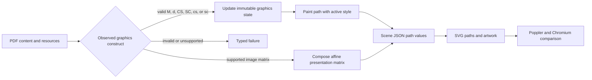

# Expanded Freeform Graphics Output

## Context

An observed Freeform export uses path miter and dash state, named ICC-based colors, and rotated or sheared embedded artwork. Rejecting these valid constructs prevents site generation, while ignoring them changes path appearance or artwork placement.

## Behavior Flow

## Description

The interpreter carries miter, dash, and selected fill/stroke color-space state. Supported named color resources resolve to grayscale, RGB, or CMYK component interpretation, and selecting a color space initializes its current color. A non-singular similarity transform scales native line width and dash metrics uniformly; a non-similarity stroke transform fails explicitly. Painted paths serialize the resulting values. Raster and traced artwork retain their complete matrix, the runtime composes it with the image-sample vertical orientation, and full-board raster validation tests board corners against the transformed image bounds. Invalid values fail before a Pages artifact can be produced.

## Scenarios

1. Given a numeric `M` operand of `4`, when a following path is stroked, then its `PaintStyle` contains miter limit `4`.
2. Given an `M` operand below `1`, when the operator is interpreted, then the build fails with a typed structure error.
3. Given a dash array `[28 28]` and phase `0`, when a following path is stroked, then its `PaintStyle` contains those values.
4. Given a dash array containing only zeros, when the operator is interpreted, then the build fails with a typed structure error.
5. Given a uniform scale of `2`, when a path with line width `3`, dash array `[2 1]`, and phase `4` is stroked, then its emitted metrics are `6`, `[4 2]`, and `8`.
6. Given a non-uniform scale or shear, when a native path is stroked, then the build fails explicitly instead of approximating the stroke.
7. Given a supported named RGB resource selected for stroke or fill, when component values are applied, then the emitted path contains the corresponding color; without component values, the selected current color starts at black.
8. Given rotated or sheared normalized artwork, when its scene is validated and rendered, then its full affine matrix remains accepted and visible.
9. Given an affine raster whose axis-aligned bounding box covers the board but whose transformed image does not, when its scene is validated, then the raster is not misclassified as full-board.
10. Given a stroked path style, when the browser builds its SVG path, then the SVG stroke presentation attributes equal the serialized values.
11. Given the motivating supported consumer, when the reusable factory evaluates it at 18 and 72 DPI, then both scales pass the fixed visual thresholds.

## Test Design

| Scenario | Instrument | Proof |
| --- | --- | --- |
| 1 | Pure `interpretOperators` unit test | A valid `M` value reaches the emitted path style. |
| 2 | Pure `interpretOperators` unit test | Out-of-range miter limits fail explicitly. |
| 3 | Pure `interpretOperators` unit test | A valid `d` pattern reaches the emitted path style. |
| 4 | Pure `interpretOperators` unit test | An all-zero dash array fails explicitly. |
| 5 | Pure `interpretOperators` unit test | Similarity scale reaches every dimensional stroke metric. |
| 6 | Pure `interpretOperators` unit test | A non-similarity stroke transform fails explicitly. |
| 7 | Pure stroke and fill `interpretOperators` unit tests | Named RGB components reach both path color channels and selection resets the current color. |
| 8 | Pure `validateScene` test plus generated-site evaluation | Non-axis-aligned artwork is accepted and correctly placed. |
| 9 | Pure `validateScene` unit test | Board coverage is based on transformed image containment rather than only extrema. |
| 10 | Browser runtime fixture plus generated-site evaluation | Scene data reaches SVG presentation attributes. |
| 11 | Real-consumer reusable-workflow run and evaluation-report inspection | End-to-end output remains visually faithful without threshold changes. |

# References

1. [Expanded graphics requirements](/prd/0005-expanded-freeform-graphics.md)
2. [Implementation issue](/issues/0005-support-expanded-freeform-graphics.md)
3. [Observed source profile](/pdf-investigation.md)
