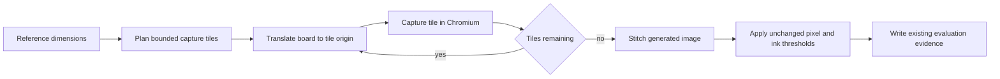

# Tiled Visual Evaluation

## Context

The evaluation oracle must compare the complete generated board with Poppler at both accepted resolutions. A browser screenshot that is blank because its viewport exceeds Chromium's practical capture limit is not evidence about generated-site fidelity.

## Behavior Flow

## Description

The evaluator reads dimensions without decoding the complete reference, then plans row-major tiles that cover those dimensions exactly. Each tile URL carries non-negative output-pixel offsets. Evaluation mode applies the requested DPI scale and the inverse offsets before scene readiness is reported. Captures stop at the first failure. The evaluator rejects missing or incorrectly sized captures, copies valid tiles into the complete image one at a time, removes temporary files after handled outcomes, and compares the complete image through the existing metric implementation.

## Scenarios

1. Given output dimensions within the capture bounds, when Chromium renders a scale, then one viewport produces the existing generated image.
2. Given output dimensions beyond either capture bound, when tiles are planned, then their rectangles cover every output pixel exactly once.
3. Given a tile origin, when evaluation mode initializes, then the board is translated by the negative output-pixel offsets at the requested DPI scale.
4. Given valid captured tiles, when they are stitched, then every output pixel comes from the corresponding tile coordinate.
5. Given the motivating consumer, when the reusable factory evaluates it at 18 and 72 DPI, then both scales use the fixed visual thresholds and produce the existing evidence filenames.

## Test Design

| Scenario | Instrument | Proof |
| --- | --- | --- |
| 1 | Pure tile-plan unit test | In-bound dimensions produce one exact tile. |
| 2 | Pure tile-plan unit test | Oversized dimensions produce the expected row-major edge tiles. |
| 3 | Browser runtime fixture | Evaluation query offsets reach the board transform. |
| 4 | Pure image-stitch unit test | Distinct source tile pixels appear at the expected output coordinates. |
| 5 | Real-consumer reusable-workflow run and report inspection | Both accepted scales pass without changing metrics, thresholds, or evidence names. |

# References

1. [Tile oversized browser evaluations](/adr/0006-tile-oversized-browser-evaluations.md)
2. [Implementation issue](/issues/0006-tile-oversized-visual-evaluations.md)
3. [Evaluation oracle](/pdf-investigation.md)
