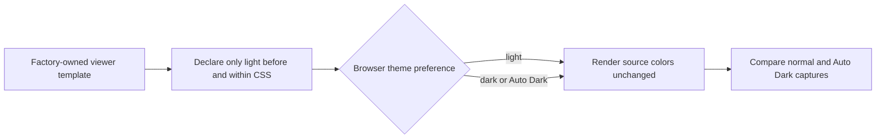

# Fixed Light Viewer

## Context

The generated site reproduces source colors on a white Freeform board. Chromium Auto Dark Theme can override an ordinary `light` color-scheme declaration, turning the white board dark and black source lines light even though parsing, scene data, and SVG colors are correct.

## Behavior Flow

## Description

The generated document declares `only light` in document metadata before loading styles, and the root element inherits `color-scheme: only light`. Browsers therefore retain the factory's explicit white board, source-derived colors, and fixed control presentation instead of adapting them to an operating-system or automatic dark theme. This behavior does not disable accessibility forced-colors modes or user-installed style extensions.

## Scenarios

1. Given the generated viewer under a light browser theme, when the scene renders, then the factory's explicit colors are used.
2. Given Chromium Auto Dark Theme, when the same scene renders, then the browser does not transform the board, scene, or controls to a dark palette.
3. Given the document before its stylesheet loads, when the browser selects its initial color scheme, then document metadata declares that only light presentation is supported.

## Test Design

| Scenario | Instrument | Proof |
| --- | --- | --- |
| 1 | Browser runtime fixture screenshot | The normal capture supplies the expected fixed-light baseline. |
| 2 | Browser runtime fixture under `WebContentsForceDark` | The Auto Dark capture is byte-identical to the normal capture. |
| 3 | Generated-template assertion | HTML metadata and root CSS both declare `only light`. |

# References

1. [Reusable factory requirements](/prd/0002-reusable-freeform-site-factory.md)
2. [Implementation issue](/issues/0007-preserve-fixed-light-viewer.md)
3. MDN WEB DOCS. `color-scheme` CSS property. Available at: <https://developer.mozilla.org/en-US/docs/Web/CSS/color-scheme>. Accessed on: 2026-08-30.
4. MDN WEB DOCS. `<meta name="color-scheme">` HTML attribute value. Available at: <https://developer.mozilla.org/en-US/docs/Web/HTML/Reference/Elements/meta/name/color-scheme>. Accessed on: 2026-08-30.
