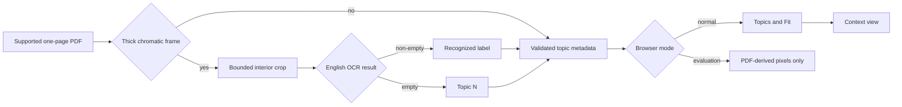

# Topic Index Navigation

## Context

[PRD 0006](/prd/0006-ocr-topic-navigation.md) requires a reader to scan and open highlighter-framed topics without treating OCR text as source content. [ADR 0007](/adr/0007-build-time-topic-ocr.md) assigns detection and recognition to the build and navigation to the shared runtime.

## Behavior Flow

## Description

The build derives optional navigation metadata from source-pixel highlighter frames and one-line English OCR. It orders topics spatially, validates their board-space bounds, and emits them independently from the rendered scene. The normal browser offers a responsive topic disclosure and the existing fit action. Topic selection pans and zooms to surrounding context; evaluation mode emits no topic chrome.

## Scenarios

1. Given a thick closed frame in any chromatic hue, when source images are inspected, then the frame becomes one topic candidate with inner and outer bounds.
2. Given a thin outline, open connector, filled region, or achromatic shape, when source images are inspected, then it does not become a topic candidate.
3. Given multiple topic candidates, when metadata is emitted, then topics are ordered by top coordinate and then left coordinate.
4. Given a candidate whose OCR output is non-empty, when the site is built, then the normalized OCR text and outer board bounds are serialized as one topic.
5. Given a candidate whose OCR process succeeds with empty output, when the site is built, then the serialized label is `Topic N`.
6. Given that Poppler or Tesseract exits unsuccessfully, when the site is built, then the build fails and no Pages artifact is uploaded.
7. Given a scene with topics in normal mode, when the page becomes ready, then bottom-left controls contain `Topics` and `Fit` but no zoom or fullscreen buttons.
8. Given a reader selecting a topic, when motion is allowed, then the board smoothly fits expanded context around the stored bounds and direct interaction can cancel the animation.
9. Given a reader who prefers reduced motion, when a topic is selected, then the target transform is applied immediately.
10. Given a desktop viewport, when a topic is selected, then the topic list remains open and the target avoids the panel; given a mobile viewport, then the list closes and focus returns to its summary.
11. Given a scene without topics, when normal mode loads, then only `Fit` is shown.
12. Given evaluation mode, when Chromium captures the site, then all controls are hidden and only PDF-derived scene pixels affect comparison.

## Test Design

| Scenario | Instrument | Proof |
| --- | --- | --- |
| 1 | Pure image tests with two synthetic hues | Detection depends on chroma and relative geometry, not yellow or source identity. |
| 2 | Pure image equivalence tests for each rejected geometry | Unrelated diagram artwork does not enter the index. |
| 3 | Pure ordering test with unsorted rectangles | OCR text cannot affect deterministic navigation order. |
| 4 | OCR normalization and scene JSON tests | Recognized labels retain validated positions. |
| 5 | Empty-output unit test | Every detected frame remains navigable. |
| 6 | Process-boundary integration tests and workflow artifact gate | Tool failures cannot publish a partial site. |
| 7 | Normal-mode Chromium DOM test | The requested controls replace zoom and fullscreen buttons. |
| 8 | Chromium interaction test with known target bounds | Selection changes scale and position and supports cancellation. |
| 9 | Chromium reduced-motion emulation | Motion preference bypasses animation. |
| 10 | Desktop and mobile Chromium viewport tests | Disclosure and focus behavior match viewport size. |
| 11 | Normal-mode Chromium test with an empty topic list | Fit remains usable for sources without frames. |
| 12 | Existing evaluation-mode test plus `make evaluate` | Interaction chrome does not change source fidelity metrics. |

# References

1. [OCR topic navigation requirements](/prd/0006-ocr-topic-navigation.md)
2. [Build-time topic OCR decision](/adr/0007-build-time-topic-ocr.md)
3. [Implementation issue](/issues/0008-add-ocr-topic-navigation.md)
