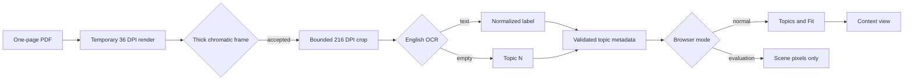

# Composited Topic Index Navigation

## Behavior Flow

## Description

The build detects geometry from visible page composition but limits OCR to accepted interiors. The browser consumes only labels and bounds; it never receives the PDF or temporary rasters.

## Scenarios

1. Given composited thick chromatic frames, when detection runs, then each closed frame becomes one candidate independent of hue and expected count.
2. Given candidates in overlapping visual rows, when ordering runs, then rows are top-to-bottom and members are left-to-right.
3. Given accepted candidates, when OCR runs, then each receives normalized text or `Topic N`; tool failure aborts the build.
4. Given topics in normal mode, when the page is ready, then controls contain `Topics` and `Fit` but no zoom or fullscreen buttons.
5. Given topic selection, when motion is allowed, then context animates for about 450 milliseconds and direct interaction can cancel it; reduced motion applies immediately.
6. Given desktop and mobile viewports, when topics are used, then the desktop panel remains open and is avoided by framing, while the mobile panel closes and returns focus at `720px` or below.
7. Given no topics, when normal mode loads, then only `Fit` is visible.
8. Given evaluation mode, when Chromium captures the board, then controls and topic chrome are hidden.

## Test Design

| Scenario | Instrument | Proof |
| --- | --- | --- |
| 1 | Synthetic frame unit test and 12-target consumer inspection | Detection follows visible geometry without count policy. |
| 2 | Pure ordering unit test | Visual rows have deterministic reading order. |
| 3 | Fallback unit test, real build, and workflow gate | Every candidate is labeled or the build fails. |
| 4, 7, 8 | Normal, empty, and evaluation Chromium DOM tests | Controls match each mode. |
| 5, 6 | Desktop/mobile manual interaction and reduced-motion inspection | Framing and responsive behavior remain accessible. |

# References

1. [Current requirements](/prd/0007-composited-ocr-topic-navigation.md)
2. [Current decision](/adr/0008-composited-topic-detection.md)
3. [Superseded behavior](/bdr/0009-topic-index-navigation.md)
4. [Implementation issue](/issues/0008-add-ocr-topic-navigation.md)
