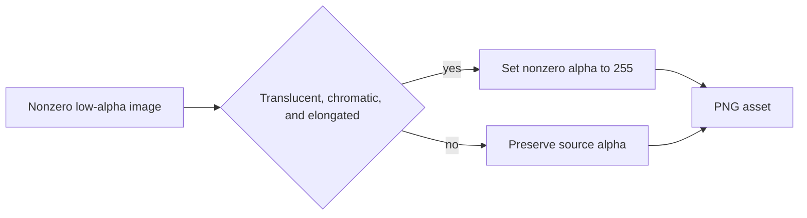

# Opaque Highlighter Output

## Behavior Flow

## Description

This record supersedes BDR 0005 by replacing its unconditional low-alpha preservation scenario with a positively classified highlighter exception. BDR 0005 scenarios 1 through 3 and 5 through 15 remain unchanged.

## Scenarios

1. Given nonzero samples below alpha `96` in a translucent image that is at least 95 percent chromatic and has aspect ratio at least `4:1`, when the raster is materialized, then every nonzero pixel has alpha `255`.
2. Given a compact translucent chromatic image, when the raster is materialized, then it retains source alpha.
3. Given a qualified stroke, when opacity changes, then RGB, zero-alpha pixels, geometry, transform, and source order remain unchanged.
4. Given the motivating consumer, when the generated asset and evaluation report are inspected, then the long highlighter is opaque and no unrelated resource changed classification.

## Test Design

| Scenario | Instrument | Proof |
| --- | --- | --- |
| 1 | Pure elongated RGBA image unit test | Positive classification makes visible pixels opaque. |
| 2 | Pure compact RGBA image unit test | Chroma alone cannot trigger the exception. |
| 3 | Unit pixel assertion and existing interpreter tests | The change is limited to alpha materialization. |
| 4 | Consumer asset and evaluation-report inspection | The requested product behavior is narrow in production. |

# References

1. [Current requirements](/prd/0008-opaque-freeform-highlighters.md)
2. [Current decision](/adr/0009-opaque-highlighter-strokes.md)
3. [Superseded behavior](/bdr/0005-fidelity-preserving-mixed-scene-output.md)
4. [Implementation issue](/issues/0009-render-highlighters-opaque.md)
