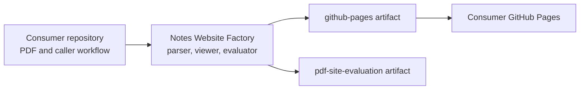

# Constitution

## Product

The repository converts exactly one one-page Apple Freeform PDF into a static, zoomable educational website. Production parsing is Haskell using `pdf-toolbox` and project-owned interpretation, validation, vectorization, and emission.

## Boundaries

- The deployed product contains no PDF, full-page PDF raster, OCR output, browser PDF parser, backend, or runtime production toolchain.
- Poppler and Chromium are development evaluation tools only.
- Unsupported source content fails explicitly.
- Deterministic transformations remain pure; filesystem and process effects stay at module boundaries.
- Output paths must never equal or contain the repository root.
- The generated site preserves source order and distinguishes traced vector artwork from genuinely raster content.

## Quality Contract

`make test` is the compile, unit, integration, and distribution gate. Rendering changes additionally require `make evaluate`, inspection of `build/evaluation/report.html`, and passing 18 and 72 DPI comparisons.

## Amendment 1: Separate Factory and Consumer Ownership

Accepted on 2026-08-23.

The factory is a reusable build system, not a notes website. It owns the Haskell generator, shared viewer, fixed quality policy, synthetic fixture, and reusable artifact-building workflow. Each consumer owns exactly one one-page Apple Freeform PDF, its site title, its caller trigger, and deployment permissions.

The factory emits validated `github-pages` and `pdf-site-evaluation` artifacts but does not deploy them. Consumer input, factory implementation, generated site, and evaluation evidence use separate filesystem roots. The production-content PDF formerly stored here is owned by its consumer repository.

